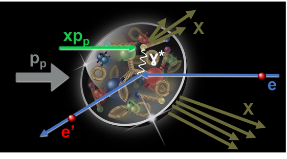
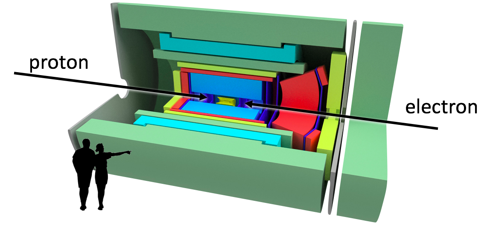
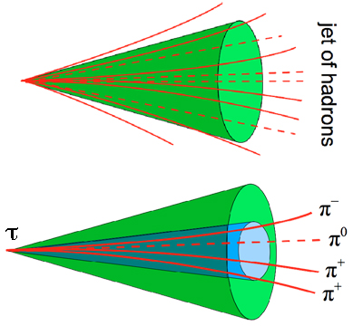

# The Search for New Physics: Identifying rare electron-to-tau conversions at the future Electron-Ion Collider
This project relates to physics at the proposed U.S. [Electron-Ion Collider](https://www.bnl.gov/bnlweb/pubaf/fact_sheet/pdf/EIC_Brochure.pdf) EIC. The EIC will collide electrons with protons (and nuclei) to explore the inner workings of protons, neutrons, and nuclei at an unprecedented level of detail. In addition, it has the potential to find "[new physics](https://en.wikipedia.org/wiki/Physics_beyond_the_Standard_Model)", i.e. phenomena that might exist in nature but have never been observed before. This project focuses on identifying one of these new phenomena in Monte Carlo simulations with the current design for an experiment at the EIC and distinguishing it from background events.

### Charged Lepton Flavor Violation- A possible signal of New Physics
There are some quantities, like energy and momentum, that are conserved in all physics processes. <a href="https://en.wikipedia.org/wiki/Noether%27s_theorem">Noether's theorem</a> states that all such conserved quantities are related to a symmetry of the physical system.

An interesting quantity to measure in an experiment is the number of charged leptons of different flavors (electron, nuon, tau). All measurements done at past and present experiment are consistent with a conversation of this charged lepton number. However, there is no known symmetry that would require this conservation. In fact, lepton flavor changes have been observed for neutral leptons, the neutrinos. Therefore, it is exciting and promising to also look for charged lepton flavor changes.

Identifying taus at the EIC would allow to search for the conversion of electrons into taus (which are heavier versions of electrons) at this facility. While the Standard Model does not explicitly forbid this process, the rates that would be consistent with the Standard Model are so low that they are way out of the reach of all past, present, and planned experiments, including the EIC. Therefore, actually measuring charged lepton flavor violation would be signal of [Physics beyond the Standard Model](https://en.wikipedia.org/wiki/Physics_beyond_the_Standard_Model).

But, it is challenging to identify with certainty the rare electron-proton collisions in wich the electron turns into a tau. If they occured, they would roughly constitute less than one in 100 million events recorded at the EIC.

### Doing Experiments with Particle Colliders
A high-energy particle [collider](https://en.wikipedia.org/wiki/Collider) like the EIC accelerates charged particles to nearly the speed of light before making them collide. The collision typically creates multiple particles that fly away from the collision point.

Experiments at particle colliders are essentially giant cameras. They use various technologies to record the identity, energy, and direction of all the particles that come out of each collision. The design of the experiment used for this project follows the typical design of a general purpose collider experiment: To measure direction, electric charge, and momentum of charged particles, it use a magnetic field that bends the path of charged particles depending on their charge and momentum, combined with a tracking detector that measures the particle trajectory. To measure the direction and energy of particles (charged or neutral), it uses so-called calorimeters. Calorimeters measure the energy of particles by stopping the particle (i.e. the particle deposits all its energy in the calorimeter) and returning a signal that is proportional to the deposited energy. If multiple particles can be grouped together based on the direction they are flying in, they are considered a <a href="https://en.wikipedia.org/wiki/Jet_(particle_physics)">jet</a>. Different jet finding algorithms exist that apply differnt criteria for this grouping.

While many particles can be measured and identified directly, others decay so quickly that we can only measure their decay products. <a href="https://en.wikipedia.org/wiki/Tau_(particle)">Taus</a> are such quickly decaying particles. Even though we cannot detect them directly, we __can__ measure their decay products and use that information to identify the original tau.

### Searching for tau decays
The goal this study is to identify electron-to-tau conversion events in Monte Carlo simulated EIC data. We focus on taus that decay into three charged [pions](https://en.wikipedia.org/wiki/Pion) (and a neutral pion and a neutrino, which escapes direct detection). These pions form a characteristically narrow and jet-like cone, which is typically narrower and contains fewer particles than the ubiquitous hadron jets. See the illustration below for a comparison between a typical hadron jet and a typical jet from a tau decaying into three charged pions. To identify taus, we need to find an effective way to distinguish tau jets from hadron jets.

 

### The data
This analysis is performed on Monte Carlo simulated data for an EIC experiment. The data are generated in two steps:

1. Simulation of the __physics process__, i.e. generating all the particles that result from the collision of an electron with a proton.
2. Simulation of the __detector response__ to the genreated particles, i.e. predicting what the real EIC experiment could actually measure and with what precision. This adds uncertainties reflecting the expected performance of the experiment to the simulated particles.

We use two input data files:
* `data/jets_lq_tau_3pi_r05_p250_e20.csv`: These are the signal events. The incoming electrons convert into taus, which subsequently decay into three charged pions. Jets are created from the collision, as well as the decay of the tau.
* `data/jets_dis_nc_r05_p250_e20.csv`: These are background events. Jets are created from the collision. The electrons keep their identity and can be detected after the collision.
* `data/jets_dis_cc_r05_p250_e20.csv`: These are background events. Jets are created from the collision. The electron converts into a neutrino that escapes detection, which is a process well described by the Standard Model.

Each row in the data files corresponds to an identified jet. Descriptions of the individual columns are given in `data/jets_column_description.xls`.

### The analysis
The Jupyter notebook for this analysis is [eic-tau-classification.ipynb](eic-tau-classification.ipynb).

### Conclusion
Improvement of true positive rate by 80% compared to cut-based event selection for AdaBOOST decision tree classifier.
